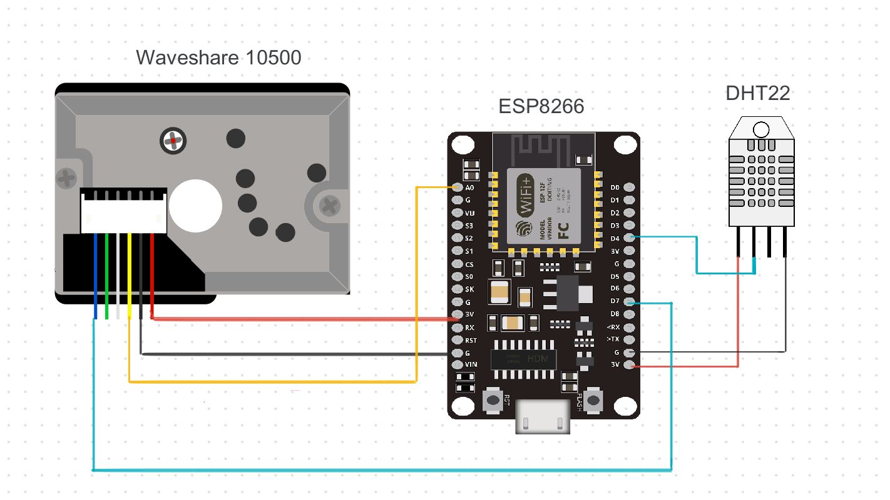
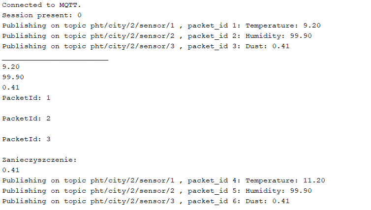

# **PHT Weather Station - ARDUINO**

# **Materials**

        - wires
        - ESP8266 NodeMCU
        - DHT22
        - GP2Y1010AU0F
        - Micro-USB

## **Wiring**

 

 

# **Setup**
    1. Install:

        Arduino's IDE
    2. Install libraries using Arduino's library manager:

    - Adafruit Unified Sensor library

    - DHT sensor library

    3. Add ESP8266 board to your project

        1.Set Arduino and open Preferences.
        2. Enter 'https://arduino.esp8266.com/stable/package_esp8266com_index.json' into Additional Board Manager URLs field.
        3. Tools -> Boards Manager -> Board -> find ESP8266
        4. select and click install button.

        After installation select your ESP8266 board from Tools -> Board menu

## **How to publish temperature and humidity readings **

 

#### **MQTT**

    Readings are published in the
    pht/city/city_id/sensor/sensor_id topics.

    sensor_id = 1 for temperature
    sensor_id = 2 fro humidity
    sensor_id = 3 for air pollution

 

#### **MQTT Libraries**

    Installing the Async MQTT Client Library

        1. Download async_mqtt_client folder
        2. Sketch -> Include Library -> Add .ZIP library and select the library you downloaded 

    Installing the ESPAsync TCP Library

        1. Download ESPAsyncTCP folder
        2. Sketch -> Include Library -> Add .ZPI library and select the library you downloaded 

 

#### **How the code works?**

   Required libraries:

    #include "DHT.h"
    #include <ESP8266WiFi.h>
    #include <Ticker.h>
    #include <AsyncMqttClient.h>

    The ESP8266 is publishing temperature readings every 10 seconds on the pht/city/city_id/sensor/sensor_id topics. Now, you can use any dashboard that supports MQTT or any other device that supports MQTT to subscribe to those topics and receive the readings.

### **Reading examples**

